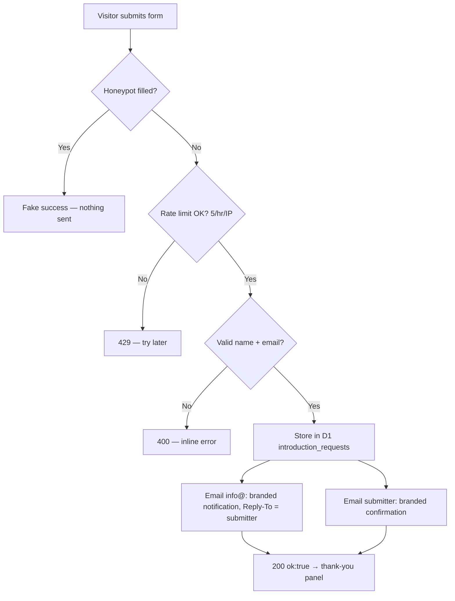
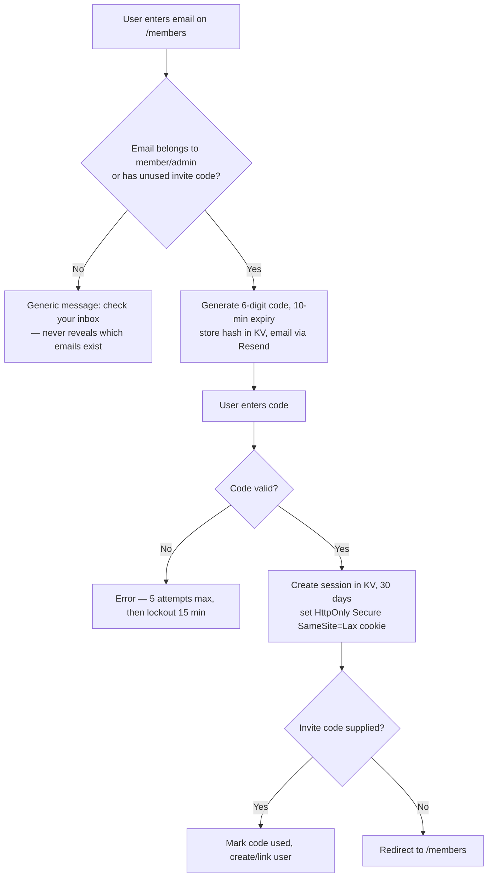
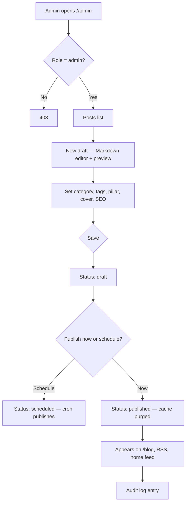
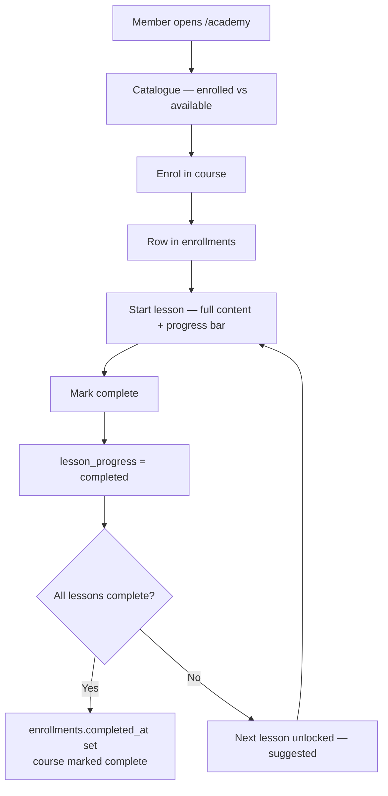
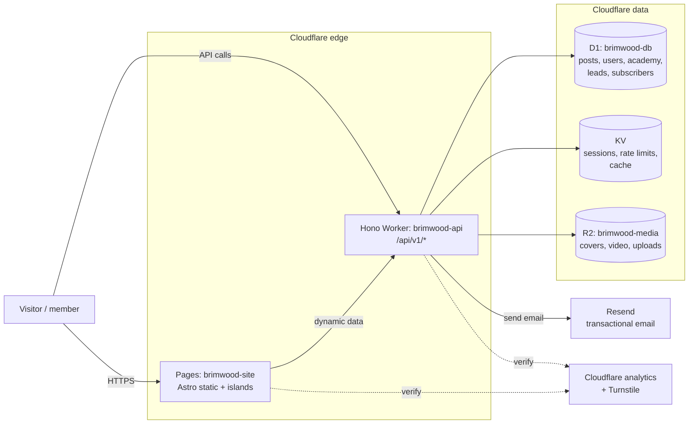
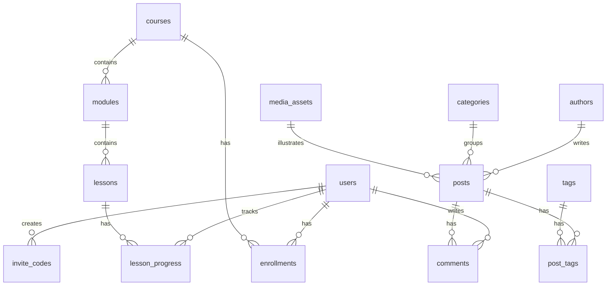
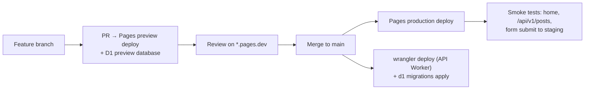

# Brimwood Innovation — Full-Stack Web Framework

**Official technical report · Version 1.1 · 30 September 2026**
**Status:** Draft for founder review · **Classification:** Internal — do not publish

Prepared as the audit, architecture design, and implementation plan for evolving
brimwoodinnovation.com from its current static "coming soon" site into a fully
functional, full-stack website (Home, Blogs, About Us, Academy, introduction
requests, newsletter, members area, admin publishing) on Cloudflare
infrastructure.

**Design authorities for this report**

- Brimwood Brand Kit v1.0 (`~/workspace/company/brand/Brimwood-Brand-Kit-v1.0/`) — final authority on logo, colours, type, voice, and content. Nothing in this framework overrides it.
- Brimwood entity profile (`~/workspace/company/entity-profile.md`) — invite/referral-only positioning, "Build a business. Build yourself.", members anonymous by default, internal business model never published.
- Canadian spelling throughout. No income promises, no hype language, no competitor criticism — including in sample copy and schemas.

**Document version history**

- **v1.1 · 30 September 2026** — Founder constraints folded in: open-source
  and free evaluation of every stack component (§4.4); 2026 best-practice
  notes (§4.5); performance budget with Core Web Vitals targets (§5);
  discoverability section covering SEO, AEO, and GEO (§8); supply-chain
  hardening (§18); Decap CMS (MIT, $0) as the recommended CMS (§4.1, §14,
  §22); cost section reworked to a hard C$0 target with free-tier guardrails
  (§20); C$0 operating target added as design principle 8. No other changes.
- **v1.0 · 30 September 2026** — Initial official report: audit, architecture,
  sitemap, flows, data model, API spec, auth, CMS plan, migration, ops,
  roadmap.

---

## Table of contents

1. [Executive summary](#1-executive-summary)
2. [Audit findings — current state](#2-audit-findings--current-state)
3. [Design principles and constraints](#3-design-principles-and-constraints)
4. [Recommended stack](#4-recommended-stack)
5. [Performance budget](#5-performance-budget)
6. [Sitemap and URL structure](#6-sitemap-and-url-structure)
7. [Section designs](#7-section-designs)
8. [Discoverability: SEO, AEO, and GEO](#8-discoverability-seo-aeo-and-geo)
9. [User flows](#9-user-flows)
10. [System architecture](#10-system-architecture)
11. [Data model](#11-data-model)
12. [REST API specification](#12-rest-api-specification)
13. [Authentication and authorisation](#13-authentication-and-authorisation)
14. [CMS and publishing workflow](#14-cms-and-publishing-workflow)
15. [Media strategy](#15-media-strategy)
16. [Migration path from the current site](#16-migration-path-from-the-current-site)
17. [Environments, deployment pipeline, and backups](#17-environments-deployment-pipeline-and-backups)
18. [Security hardening](#18-security-hardening)
19. [Monitoring and analytics](#19-monitoring-and-analytics)
20. [Cost estimate](#20-cost-estimate)
21. [Phased build roadmap](#21-phased-build-roadmap)
22. [Open decisions for the founder](#22-open-decisions-for-the-founder)
23. [Appendix A — verification notes and assumptions](#23-appendix-a--verification-notes-and-assumptions)

---

## 1. Executive summary

Brimwood's web presence today is a single static page on Cloudflare Pages,
backed by one Cloudflare Worker that handles introduction requests and a
double opt-in newsletter through Resend. It works, it is on-brand, and the
email system is verified end to end. It is not a platform: there is no
database, no user accounts, no content management, and no way to publish a
blog post or an academy lesson without hand-editing HTML and re-uploading a
zip file.

This report designs the full-stack successor, staying Cloudflare-native so the
team keeps one vendor, one dashboard, and near-zero server maintenance:

- **Frontend:** Astro (static-first, content collections for blogs and academy) on Cloudflare Pages.
- **Backend:** a Hono API on Cloudflare Workers (`brimwood-api`), replacing and absorbing the current `brimwood-introduction` Worker.
- **Database:** Cloudflare D1 (SQLite) for posts, academy content, users, introductions, and subscribers.
- **KV:** sessions, rate limits (already in use), and cache.
- **R2:** media storage (blog covers, academy video, uploads).
- **Email:** Resend, reusing the existing branded templates and double opt-in logic.

Everything the founder approved stays: the living dot-grid hero, the brand
system, the introduction funnel, the newsletter with double opt-in, and the
invite-only posture — which becomes a first-class auth model (magic-link
sign-in, invite codes, no passwords).

The build is phased across five milestones so value ships early: the content
site first, then the API and database, then Academy, then the admin CMS, then
hardening and launch. The countdown element retires naturally after the
30 October 2026 launch date; the framework treats launch as a content change,
not a rebuild.

Two hard constraints shape every choice below. **Cost:** the founder already
owns the domain and hosting, so the operating target is **C$0 total** —
open-source code and free tiers only, with a named open alternative for every
proprietary piece (§4.4) and guardrails that keep usage inside free limits
(§20). **Speed:** a formal performance budget (§5) caps page weight and Core
Web Vitals, enforced in CI. **Discoverability:** SEO, answer-engine (AEO),
and generative-engine (GEO) optimisation are engineered into the content
model from day one (§8).

---

## 2. Audit findings — current state

All claims below were verified against files in `~/workspace/company/` on
30 September 2026. Items that could not be verified from files are marked
**(assumption)**.

### 2.1 What exists and works

| Component | Location / detail | State |
|---|---|---|
| Live site | Cloudflare Pages project `brimwood-coming-soon`; `brimwoodinnovation.com` + `www` | Live, deployment `brimwood-coming-soon-v7.zip` |
| Build source | `~/workspace/company/website/build/index.html` (single file, ~1,100 lines with the v7 engine) | Current |
| Hero | Living dot-grid canvas (v7): evolving wave field, 96 re-cast actor dots, 65-second life cycle (drift → gather → shapes → BUILD/DREAM/BRIMWOOD words → divide → fight → army → release), light trails, firefly breathing, cursor response, tap-to-summon, left-arrow disabled | Live, approved |
| Countdown | Targets Friday 30 October 2026, 19:00 viewer-local; label "Expected to launch" | Live |
| Introduction form | `POST /api/introduction` (JSON), honeypot field, inline error state, thank-you panel | Live, verified |
| Email hub Worker | `~/workspace/company/website/worker-introduction.js` → Worker `brimwood-introduction`, route `brimwoodinnovation.com/api/*` | Deployed (dashboard) |
| Email endpoints | `POST /api/introduction`, `POST /api/newsletter`, `GET /api/newsletter/verify?token=…`, `GET /api/newsletter/unsubscribe?email=…&token=…` | Verified in source |
| Resend delivery | Sending-only key in Worker secret `RESEND_API_KEY`; branded templates in Worker source | Verified working |
| Newsletter storage | KV namespace `brimwood-newsletter`, binding `NEWSLETTER`; keys `sub:<email>`, `pending:<token>`, `rl:<key>` | In use |
| Rate limiting | KV-backed: 5 introduction / 3 newsletter signups per IP per hour (429 beyond) | Verified in source |
| Brand assets | Logos (colour, reversed, stacked, symbol), favicons, app icons, Plus Jakarta Sans, colour spec | Kit v1.0, final |
| Email previews | `~/workspace/company/email/previews/*.html`, regenerated from real template code | Current |
| Content pillars | Micro business 30% / AI in practice 30% / Owner mindset 20% / Members and hub 20% | Final per kit |

### 2.2 Gaps for a full-stack site

1. **No database.** Newsletter subscribers live in KV (fine at this scale, but not queryable: no admin list, no segmentation, no export). Introduction requests exist only as emails to `info@`.
2. **No user accounts or sessions.** Nothing to build a members area or Academy progress tracking on.
3. **No content management.** Publishing means editing HTML/JS by hand and uploading a zip through the dashboard. No drafts, no scheduling, no revisions.
4. **No blog, About, or Academy surfaces.** The sitemap is one page.
5. **Deployment is manual.** Dashboard direct-upload of zips; no Git history, no preview environments, no rollback beyond manual re-upload. (Earlier zips v2–v7 are archived locally — that is the only version history.)
6. **No media pipeline.** Images are committed into the zip; no uploads, no optimisation, no video hosting.
7. **Analytics is manual.** Visitor counts come from occasional dashboard checks; the dashboard artifact is refreshed by a scheduled job reading CLI tools.
8. **Legal pages absent.** No privacy policy or terms — required before accounts, newsletters at scale, and analytics.

### 2.3 What must be preserved

- The v7 hero engine (extract as a reusable component, not a rewrite).
- The brand CSS variables and layout language.
- The email templates, double opt-in flow, and rate-limiting behaviour.
- The introduction funnel copy and honeypot pattern.
- The invite-only positioning — the framework must not introduce "Sign up" / "Join now" language anywhere public.

---

## 3. Design principles and constraints

1. **Cloudflare-native.** Pages + Workers + D1 + KV + R2. One vendor, one identity plane, no servers to patch, generous free tiers.
2. **Small-team maintainable.** The founder plus occasional contractors. Favour boring, well-documented choices over clever ones. Content editing must not require a developer once the CMS phase lands.
3. **Brand-kit supremacy.** Every template, email, and admin screen uses the kit: Emerald-led palette, Plus Jakarta Sans, exact logo files, Canadian spelling, short sentences.
4. **Invite-only by construction.** Public surfaces never offer self-registration. Accounts are created by invitation, approved introduction, or admin action. The word "signup" does not appear on public pages (newsletter subscription is the deliberate exception — it is a mailing list, not membership).
5. **Privacy by default.** Members anonymous unless they give written permission. Minimal data collection. No third-party trackers beyond Cloudflare's own analytics.
6. **Progressive enhancement.** The public site works without JavaScript for reading; interactivity (forms, progress) layers on top. The hero canvas already respects `prefers-reduced-motion`.
7. **Content longevity.** Blog posts and academy lessons are Markdown/MDX source of truth in version control, renderable for decades, exportable in minutes.
8. **C$0 operating target.** The domain and hosting are already owned, so the
   entire build — code, CMS, tooling, email, media — must run at zero
   marginal cost. Every component is open-source or on a free tier with a
   documented open alternative (§4.4); free-tier guardrails are part of the
   design (§20). No paid tier is adopted without the founder's explicit
   approval.

---

## 4. Recommended stack

### 4.1 The recommendation

| Layer | Choice | Why |
|---|---|---|
| Public site | **Astro** on Cloudflare Pages | Static-first; content collections give typed Markdown/MDX blogs with zero CMS to maintain; partial hydration ("islands") keeps pages fast; the existing vanilla hero drops in as an island unchanged. |
| API | **Hono** on Cloudflare Workers (`brimwood-api`) | The standard Workers API framework: Express-like routing the team already writes, tiny bundle, first-class D1/KV/R2 bindings. Absorbs `brimwood-introduction` so there is one API surface. |
| Database | **Cloudflare D1** (SQLite) | Relational data the site needs (posts, courses, users, leads) without operating Postgres. Migrations are SQL files in the repo. |
| Sessions / rate limits / cache | **Cloudflare KV** | Already in use for rate limiting and newsletter state; sessions and HTML/JSON caches fit naturally. |
| Media | **Cloudflare R2** | S3-compatible object storage with zero egress fees — ideal for blog covers and academy video. |
| Email | **Resend** (keep) | Already verified; branded templates exist. Keep the sending domain and warm reputation. |
| Auth | **Magic-link codes** (email, 6-digit, 10-minute expiry), sessions in KV | No passwords to store, reset, or leak. Fits invite-only: codes only go to known addresses. |
| Styling | Brand CSS variables + hand-written CSS (keep current approach) | The current CSS is clean and on-brand; no framework needed. Optionally adopt Tailwind later — not recommended now (adds build complexity for little gain). |
| CMS | **Decap CMS** (MIT, git-based, $0) | The open-source git CMS: Markdown stays the source of truth, publishing stays a git merge, non-technical publishing without a paid seat. Configured in the Astro site; auth via a small open-source GitHub OAuth Worker. |
| Forms protection | Cloudflare Turnstile | Free, privacy-friendly CAPTCHA replacement for public forms. |
| Repo & deploys | GitHub + Git-connected Pages; `wrangler` for Workers/D1 | Replaces zip uploads with preview deployments per branch and one-command production deploys. |

### 4.2 Alternatives considered (and why not)

- **Next.js on Pages.** Heavier runtime, edge-compatibility caveats, and overkill for a content-led marketing site. Revisit only if the team hires React specialists.
- **WordPress / Ghost (hosted).** Fast to start, but a second vendor, PHP/Node server to maintain, theming fights the brand kit, and member data leaves Cloudflare.
- **Supabase / Firebase.** Excellent products, but they duplicate what D1 + Workers already cover and add a vendor to the trust boundary.
- **Passwords + OAuth logins.** Passwords create reset flows, breach liability, and support load. Social logins dilute the invite-only brand. Magic codes are simpler and sufficient.
- **A full SPA (React/Vue) frontend.** Worse SEO, worse first paint, more JavaScript to maintain — for a site that is mostly reading.
- **Paid-tier CMS products (Contentful, Sanity growth tiers, etc.).** Rejected
  under the C$0 constraint: per-seat pricing and usage meters the founder
  does not need. Decap CMS does the job at $0 with Markdown as the source
  of truth.

### 4.3 Repository layout (proposed)

```
brimwood-web/                  # one monorepo
├── site/                      # Astro — public website (Pages)
│   ├── src/
│   │   ├── components/        # Hero.astro (v7 canvas island), Header, Footer, Cards…
│   │   ├── content/           # blog posts, academy lessons (MDX, git-managed)
│   │   │   ├── blog/
│   │   │   └── academy/
│   │   ├── layouts/
│   │   ├── pages/             # index, about, blog, academy, introduce, legal…
│   │   └── styles/            # brand.css (variables + components)
│   └── astro.config.mjs
├── api/                       # Hono — brimwood-api Worker
│   ├── src/
│   │   ├── routes/            # posts, academy, auth, admin, forms, newsletter
│   │   ├── lib/               # db, email (Resend + templates), rateLimit, auth
│   │   └── index.ts
│   ├── migrations/            # D1 migrations (0001_init.sql, …)
│   └── wrangler.toml
├── admin/                     # Decap CMS (MIT) config served at /admin — no separate app
└── docs/                      # this report, runbooks, content guide
```

TypeScript for the API (Hono is TS-first); the Astro site can stay mostly
`.astro` + vanilla JS, reusing the current scripts.

### 4.4 Open-source and free evaluation

Every component is either open-source or free-tier with a named open
alternative. Nothing in the recommended stack requires a paid tier at
Brimwood's scale, and no new proprietary paid dependency is introduced.
(Licence and free-tier figures below are per public project records as of
September 2026 — re-verify at build time; flagged as **(assumption)** where
they drive cost.)

| Component | Licence / cost | If it ever stops being free — open alternative |
|---|---|---|
| Astro (site) | **MIT**, free | n/a — already open |
| Hono (API) | **MIT**, free | n/a — already open |
| TypeScript / Zod | Apache-2.0 / **MIT**, free | n/a — already open |
| `wrangler` CLI | **Apache-2.0**, free | n/a — already open |
| Decap CMS (admin publishing) | **MIT**, free, git-based | n/a — already open |
| D1 (database) | Proprietary, **C$0** on free tier | libSQL (**MIT**, self-hostable SQLite fork) — keep D1: zero servers to run, co-located with Workers |
| KV (sessions, limits, cache) | Proprietary, **C$0** on free tier | Valkey (**BSD-3-Clause**, self-hosted) — keep KV: already in use, generous free tier |
| R2 (media) | Proprietary, **C$0**, zero egress fees | MinIO (**AGPL-3.0**, self-hosted S3) — keep R2: no server to run, egress is the expensive part and R2 charges none |
| Resend (email) | Proprietary, **C$0** (3,000 emails/mo free) | Brevo free tier (300/day) as the free fallback — keep Resend: verified working, branded templates exist, projected volume fits (see §20) |
| Turnstile (bot protection) | Proprietary, **free unlimited** | mCaptcha (**AGPL-3.0**, self-hosted) — keep Turnstile: free, privacy-friendly, zero maintenance; honeypot already exists as a second layer |
| GitHub (repo, Actions) | Proprietary, **free** (private repos, 2,000 Actions min/mo) | Forgejo (**MIT**, self-hosted) — keep GitHub: free minutes cover Astro builds, no server to maintain |

Net: the entire build toolchain and runtime are **C$0** — open-source code on
top of Cloudflare's free tiers, with a documented open alternative for every
proprietary piece. The domain is already owned (sunk cost, excluded from the
build budget).

### 4.5 Why this is 2026 best practice

- **Astro:** the static-first standard for content sites — islands
  architecture (zero JS by default, hydrate only the hero), typed content
  collections, and built-in view transitions.
- **Hono:** the de-facto API framework on Cloudflare Workers — Express-like
  ergonomics in a sub-15 KB bundle, first-class D1/KV/R2 bindings.
- **D1:** serverless SQLite at the edge — relational data with plain SQL
  migrations, no Postgres to operate.
- **Magic-link codes:** the current passwordless standard for small
  communities — no password database to breach, fits invite-only.
- **Decap CMS:** the standard git-based open-source CMS — Markdown stays
  the source of truth, publishing stays a git merge.
- **Turnstile:** the privacy-friendly CAPTCHA replacement — no Google
  reCAPTCHA tracking on public forms.
- **Static-first + edge-dynamic:** pages are pre-rendered HTML (fast, SEO);
  Workers only run where state is needed (forms, auth, progress). This split
  is what keeps both the performance budget (§5) and the C$0 target (§20)
  achievable.

---

## 5. Performance budget

Lightning-fast is a feature, and Core Web Vitals are a Google ranking
factor — so speed is budgeted like money. Every page ships against these
caps; Lighthouse CI fails the build when a pull request breaks them.

### 5.1 Core Web Vitals targets

Measured on a Moto G4-class mobile profile with 4G throttling (lab), and on
real visitors via Cloudflare Web Analytics (free, privacy-friendly, no
cookies — field data).

| Metric | Must not exceed | Target |
|---|---|---|
| Largest Contentful Paint (LCP) | 2.5 s | ≤ 1.8 s |
| Interaction to Next Paint (INP) | 200 ms | ≤ 100 ms |
| Cumulative Layout Shift (CLS) | 0.1 | 0 |

Static-first Astro pages pre-render to HTML, so LCP is typically the hero
text or logo — both instant. The canvas hero never blocks first paint: it
initialises after the content is on screen.

### 5.2 Page-weight budgets (transfer size)

| Page | Total cap | JavaScript cap | CSS cap |
|---|---|---|---|
| Home (`/`) | 200 KB | 60 KB | 30 KB |
| Blog post (`/blog/[slug]`) | 150 KB | 20 KB | 30 KB |
| Academy lesson | 200 KB | 40 KB | 30 KB |
| Admin (`/admin`) | 400 KB | 250 KB | 50 KB |

Budgets exclude responsive images below the fold (lazy-loaded) and video
(streamed on demand). Gzip/Brotli is on by default via Cloudflare.

### 5.3 The v7 hero stays a lightweight island

The living dot-grid engine is already close to ideal: vanilla JavaScript,
zero dependencies, roughly 30 KB unminified (~12 KB gzipped). As an Astro
island on the home page only:

- No framework runtime ships to run it — the existing engine drops in
  unchanged inside a `client:load` island.
- `devicePixelRatio` is capped at 2 (already in the engine); `requestAnimationFrame`
  pauses automatically when the tab is hidden, so background tabs cost nothing.
- `prefers-reduced-motion` renders one static frame (already implemented) —
  no animation, no CPU cost, no vestibular risk.
- Pointer tracking is already smoothed through the engine's eased cursor
  values; no per-event layout work.

### 5.4 Fonts

Plus Jakarta Sans is final per the brand kit. Strategy:

- **Self-host** the woff2 files (latin subset) from the repo — the kit
  supplies the font, so the Google Fonts request disappears entirely. One
  fewer third party, one fewer render-blocking request, better privacy
  (supports design principle 5).
- Preload only the weights used above the fold (400, 700); `font-display: swap`.
- Font budget: ≤ 80 KB total for the subsets served.

### 5.5 CSS: hand-rolled, no frameworks

The brand system is CSS custom properties plus hand-written components —
keep it that way. Heavy CSS frameworks (Tailwind, Bootstrap) are rejected:
they add build complexity and ship unused utilities, while the current
approach is already small, readable, and exactly on-brand. Astro inlines
critical CSS automatically. Keep selector specificity low and never
`@import` at runtime.

### 5.6 Responsive and reduced motion

- Breakpoints stay mobile-first: 560 px and 860 px (existing), plus a
  1200 px content container. The canvas already resizes via
  `ResizeObserver`.
- Touch targets ≥ 44 px; no hover-dependent actions on touch layouts.
- Under `prefers-reduced-motion`: static hero frame, no view-transition
  animation, no autoplaying video, `scroll-behavior: auto`.

### 5.7 Enforcement (all free, all in CI)

- **Lighthouse CI** on every pull request (GitHub Actions, free minutes):
  asserts the §5.1 targets and §5.2 budgets; red builds do not merge.
- **Cloudflare Web Analytics** (free): real-user Core Web Vitals on the
  production domain, reviewed monthly.
- **Image discipline** (§15): WebP/AVIF via `srcset`, lazy loading below
  the fold, covers capped at 1600 px wide.

---

## 6. Sitemap and URL structure

### 6.1 Public sitemap

```
/                                  Home — hero (v7), promises, how it works,
                                   featured posts, academy preview, intro CTA
/about                             About Us — story, standard, the hub, rhythm
/about/hub                         (optional sub-page) The physical space
/blog                              Blog index — featured, categories, search
/blog/[slug]                       Article page
/blog/category/[slug]              Category archive
/blog/tag/[slug]                   Tag archive
/blog/rss.xml                      RSS feed
/academy                           Academy catalogue — courses, levels, outcomes
/academy/[course]                  Course overview (syllabus, preview lessons)
/academy/[course]/[lesson]         Lesson page (gated: members see full + track progress)
/introduce                         Introduction request (dedicated page; the home
                                   section anchors here)
/newsletter                        Newsletter — what it is, signup, archive of
                                   past letters (titles + excerpts, optional)
/newsletter/confirmed              Post-verify landing (Worker can redirect here)
/privacy                           Privacy policy
/terms                             Terms of use
```

Post-launch, the home countdown retires (it is a campaign element for the
30 October 2026 launch, not a permanent fixture). Keep the component in the
repo for future campaigns.

### 6.2 Gated sitemap

```
/members                           Member dashboard — my courses, progress,
                                   resources, upcoming rhythm (Mon/Wed/Fri)
/members/settings                  Profile, email preferences
/admin                             Publishing CMS — posts, academy, media,
                                   introductions inbox, subscribers, invite codes
```

### 6.3 URL conventions

- Lowercase, hyphenated slugs; no dates in blog URLs (`/blog/ship-weekly` not `/blog/2026/10/ship-weekly`).
- Academy URLs nest under the course for context.
- Legacy `/api/*` endpoints keep working (the site's forms already call them); new API lives under `/api/v1/*`.

---

## 7. Section designs

All sections share the site chrome: sticky blurred header (colour logo,
"Request an introduction" button), footer (reversed logo, social links,
address, legal links), and the brand type/colour system. Signal Green is used
for small highlights only, never behind text.

### 7.1 Home (`/`)

Keeps the current page's structure and upgrades it into a living front door:

1. **Hero** — the v7 living dot-grid canvas, logo lockup, eyebrow ("Toronto · Est. 2026" post-launch), H1 "Build a business. Build yourself.", lede, primary CTA "Request an introduction".
2. **Belief strip** — "Elite by effort, not by background."
3. **What every member gets** — the four promise cards (existing).
4. **How it works** — Introduction → Build → Grow together (existing).
5. **From the blog** — 3 latest published posts (cards: cover, category, title, excerpt, reading time).
6. **Academy preview** — course cards with level and lesson count; CTA "Explore the Academy".
7. **Introduction CTA** — the existing form section (kept verbatim, including honeypot).
8. **Footer.**

### 7.2 About Us (`/about`)

- **Story:** why Brimwood exists — a selective innovation hub for ambitious people building AI-powered micro businesses. Short paragraphs, one idea each.
- **The standard:** "Elite by effort, not by background." What it demands (show up, ship weekly, be generous) — framed as expectations, never hype.
- **The hub:** the physical room at 1365 Gerrard St E Unit 2 — build floor, collision hours, demo nights. Photography when available; no renders presented as real.
- **The rhythm:** Monday Commit · Wednesday Forge · Friday Show + dine · monthly public demos.
- **What we are not:** not a coworking desk rental, not a course factory, not an accelerator that takes a cut and disappears. (States positioning without criticising competitors.)
- **CTA:** "Request an introduction."
- Explicitly excluded: the internal business model, revenue percentages, member names or photos without written permission and draft review.

### 7.3 Blogs (`/blog`)

- **Index:** featured post hero, filter by category (the four content pillars double as categories), tag chips, search box, paginated cards.
- **Article page:** title, category, reading time, publish date, cover image, body in readable measure, author card (first name + role only, or "Brimwood Team" — anonymity default), share links, related posts, moderated comments (Phase 2+).
- **Voice rules enforced in the CMS:** Canadian spelling check, banned-phrase list (income promises, "10x", "hustle", "guaranteed"), one idea per paragraph. The content guideline's pillar mix (30/30/20/20) is a dashboard metric in the admin.
- **RSS** at `/blog/rss.xml` and per-category feeds for the newsletter pipeline.

### 7.4 Academy (`/academy`)

- **Catalogue:** course cards — title, tagline, level (Foundations / Builder / Operator), lesson count, total time, visibility badge. Public catalogue; lesson content gated to members (preview lessons open to all).
- **Course page:** outcomes ("You will be able to…"), syllabus by module, instructor line ("Taught by Brimwood builders" — no individual claims), enrol button (members) or introduction CTA (visitors).
- **Lesson page:** video or written lesson, transcript, resources/downloads, "Mark complete", next-lesson navigation, progress bar. Progress persists per member.
- **Positioning:** the Academy teaches the skills from the "four promises" — hands-on AI practice for owner-operators. No certificates-as-status, no income claims, no "become a millionaire" modules.

### 7.5 Introduction (`/introduce`)

The existing form, promoted to a full page: name, email, referral (optional),
"What are you building?" message, honeypot, Turnstile. Same API, same emails,
same thank-you copy. Adds: what happens next (1. we read every request,
2. a conversation, 3. invitation) — sets expectations without promising
outcomes.

### 7.6 Newsletter (`/newsletter`)

Explains the list ("We write when there is something worth your time — no
noise."), signup form (name optional, email, honeypot, Turnstile), double
opt-in unchanged. Optional archive of past letters (titles + excerpts only —
full letters stay email-exclusive to protect the list's value).

### 7.7 Members (`/members`, gated)

- Dashboard: enrolled courses with progress bars, continue-learning links.
- Rhythm: this week's Monday Commit / Wednesday Forge / Friday Show schedule.
- Resources: hub handbook excerpts, useful links (admin-curated).
- Settings: name, email preferences (newsletter on/off), sign out.
- Nothing here is indexed by search engines (`noindex`, auth-walled).

### 7.8 Admin (`/admin`, role-gated)

- **Dashboard:** at-a-glance — drafts, scheduled posts, new introduction requests, subscriber count, pillar mix of recent posts.
- **Posts:** list, filter by status, rich Markdown editor with preview, cover upload (R2), SEO fields, schedule/publish, pillar tagging.
- **Academy:** courses → modules → lessons tree; lesson editor; preview-lesson toggle; reorder by drag or sort-order fields.
- **Inbox:** introduction requests table with status workflow (new → contacted → invited → declined / spam), notes field, one-click "create invite code".
- **Subscribers:** newsletter list (search, export CSV), manual unsubscribe.
- **Invite codes:** generate, set max uses and expiry, see redemption.
- **Media library:** R2 browser — upload, alt text, copy URL.
- **Audit log:** who published/changed what, when.

---

## 8. Discoverability: SEO, AEO, and GEO

The site must be found by search engines, quoted by answer engines, and
cited accurately by AI assistants. All three are engineered in — not bolted
on — and all tooling is free and open-source.

### 8.1 SEO (search engines)

- **Semantic HTML:** `header`/`main`/`article`/`footer` landmarks, one `h1`
  per page, logical heading order. Astro outputs clean HTML by default.
- **Meta layer:** unique `<title>` and meta description per page, canonical
  URLs, Open Graph + Twitter cards — via Astro's first-party SEO
  integrations (MIT-licensed) or a small hand-rolled layout; no paid plugin.
- **Crawlability:** `robots.txt` plus XML sitemaps (Astro sitemap
  integration, MIT) covering posts, categories, courses, and lessons;
  clean hyphenated slugs (see §6.3); RSS feed for the blog (already planned).
- **Structured data (JSON-LD):** `Organization` on the home page,
  `BlogPosting` on articles, `Course` on academy courses, `FAQPage` on FAQ
  blocks, `BreadcrumbList` on nested pages. Validate with Google's free Rich
  Results Test and the Schema.org validator before launch.
- **Images:** descriptive alt text required by the CMS (§14); file names
  match slugs.
- **Speed as SEO:** the §5 performance budget is part of the SEO plan —
  Core Web Vitals are a ranking factor.

### 8.2 AEO (answer engines — featured snippets, voice answers)

Content is structured so machines can lift direct answers:

- **Question-led headings:** H2s phrased as the questions readers actually
  ask ("How does Brimwood select members?").
- **Direct-answer blocks:** every post opens its key sections with a
  40–60 word self-contained answer before the deeper explanation.
- **Definition callouts** and **"Key takeaways"** boxes at the top or
  bottom of each post — the exact shapes featured snippets prefer.
- **FAQ schema:** every post carries an FAQ block (see §8.4); FAQPage
  JSON-LD is emitted automatically.
- Tables for comparisons, ordered lists for processes.

### 8.3 GEO (generative engines — being cited by AI assistants)

AI assistants cite content that is quotable, factual, and attributable:

- **Self-contained factual chunks:** statistics and claims always appear
  with their source in the same paragraph, so a quoted chunk stays true
  out of context.
- **Author expertise signals (E-E-A-T):** every post has a named author
  with a short expertise bio; the About page documents who Brimwood is.
- **Consistent entity naming:** always "Brimwood Innovation" — never
  variants — so models resolve one entity.
- **`llms.txt`:** a machine-readable site summary at `/llms.txt`
  following the emerging convention (assumption: convention still
  stabilising — keep the file simple: who we are, what we publish, key
  URLs), helping AI crawlers represent Brimwood accurately.
- **Members area and `/admin` are `noindex`** — AI answers should cite
  public content only.

### 8.4 CMS enforcement

Discoverability is a publishing checklist, not a hope. The content
collection schema (Zod) and the Decap CMS config both require, per post:

- `description` (meta description, 120–160 characters),
- `faq` (at least one question/answer pair),
- `takeaways` (3–5 bullets),
- `coverAlt` (image alt text),
- schema fields (`datePublished`, `author`).

A post cannot move to "ready" without them. The editorial guardrails in
§14 apply unchanged.

---

## 9. User flows

### 9.1 Visitor → reader → subscriber → member funnel

```mermaid
flowchart TD
    A[Visitor lands on /] --> B{Interested?}
    B -->|Reads| C[/blog or /about]
    B -->|Wants in| D[/introduce]
    C --> E{Subscribes?}
    E -->|Yes| F[/newsletter signup]
    E -->|No| C
    F --> G[Double opt-in email]
    G --> H{Confirms?}
    H -->|Yes| I[Subscriber — receives letters]
    H -->|No| J[Pending expires in 3 days]
    I --> K{Requests introduction?}
    K -->|Yes| D
    D --> L[Introduction request stored + emails sent]
    L --> M[Team reviews — status: new → contacted]
    M --> N{Fit?}
    N -->|Yes| O[Invite code issued]
    N -->|Not now| P[Stays subscriber]
    O --> Q[Member redeems code → magic-link account]
    Q --> R[Member dashboard + Academy]
```

### 9.2 Introduction request flow (as built today, carried forward)



Change from today: the request is now also stored in D1 (status `new`) so the
admin inbox can triage it. Emails remain the notification channel.

### 9.3 Magic-link sign-in flow



The "generic message" branch matters: the endpoint must not let anyone
enumerate which email addresses are members.

### 9.4 Admin publishing flow



### 9.5 Academy enrolment and progress flow



---

## 10. System architecture

### 10.1 Request flow



Notes:

- Pages serves everything static, including blog/academy pages pre-rendered at build time. The Worker is called only for dynamic behaviour: auth, progress, forms, admin writes.
- The current route `brimwoodinnovation.com/api/*` already points at a Worker; the new `brimwood-api` Worker takes over that route. Legacy endpoints (`/api/introduction`, `/api/newsletter*`) keep working unchanged — the Hono app mounts them first.
- Media is served from R2 via a custom path (`/media/*`) with cache headers; the Worker signs admin uploads.
- A scheduled Worker (cron trigger, same codebase) publishes scheduled posts and sends the newsletter digest.

### 10.2 Environments

| Environment | Frontend | API | Database |
|---|---|---|---|
| Production | `brimwoodinnovation.com` (Pages production) | `brimwood-api` production Worker | `brimwood-db` (D1 production) |
| Preview | `*.brimwood-site.pages.dev` per branch/PR | Same Worker, `ENV=preview` | `brimwood-db-preview` (D1) |
| Local | `astro dev` + `wrangler dev` | `wrangler dev` | Local D1 (miniflare) |

Preview deploys get their own D1 so content experiments never touch production.

---

## 11. Data model

### 11.1 Entity-relationship overview



### 11.2 D1 schema (SQLite dialect, apply as migrations)

Conventions: `TEXT PRIMARY KEY` UUIDs (`crypto.randomUUID()`), timestamps as
ISO-8601 UTC text with `strftime('%Y-%m-%dT%H:%M:%fZ','now')` defaults,
soft `status` enums via `CHECK`, foreign keys with `ON DELETE CASCADE` where
the child is meaningless without the parent.

```sql
-- 0001_init.sql — users, invites, sessions live in KV (see §13)

CREATE TABLE users (
  id          TEXT PRIMARY KEY,
  email       TEXT NOT NULL UNIQUE,
  name        TEXT NOT NULL,
  role        TEXT NOT NULL DEFAULT 'member'
              CHECK (role IN ('admin', 'member')),
  status      TEXT NOT NULL DEFAULT 'active'
              CHECK (status IN ('active', 'suspended')),
  referral    TEXT,                       -- who introduced them (free text)
  created_at  TEXT NOT NULL DEFAULT (strftime('%Y-%m-%dT%H:%M:%fZ','now')),
  updated_at  TEXT NOT NULL DEFAULT (strftime('%Y-%m-%dT%H:%M:%fZ','now'))
);
CREATE INDEX idx_users_email ON users(email);

CREATE TABLE invite_codes (
  id          TEXT PRIMARY KEY,
  code        TEXT NOT NULL UNIQUE,       -- e.g. BRIM-7K2Q-9XD4
  created_by  TEXT REFERENCES users(id),
  max_uses    INTEGER NOT NULL DEFAULT 1,
  uses        INTEGER NOT NULL DEFAULT 0,
  expires_at  TEXT,                       -- ISO-8601, NULL = no expiry
  note        TEXT,                       -- e.g. "For Maya's referral"
  created_at  TEXT NOT NULL DEFAULT (strftime('%Y-%m-%dT%H:%M:%fZ','now'))
);
CREATE INDEX idx_invite_codes_code ON invite_codes(code);
```

```sql
-- 0002_blog.sql

CREATE TABLE authors (
  id            TEXT PRIMARY KEY,
  name          TEXT NOT NULL,            -- display name or "Brimwood Team"
  role_title    TEXT,                     -- e.g. "Builder, Cohort 1"
  bio           TEXT,
  avatar_r2_key TEXT
);

CREATE TABLE categories (
  id          TEXT PRIMARY KEY,
  slug        TEXT NOT NULL UNIQUE,
  name        TEXT NOT NULL,
  description TEXT
);
-- Seed: micro-business / ai-in-practice / owner-mindset / members-and-hub
-- (mirrors the four content pillars)

CREATE TABLE tags (
  id    TEXT PRIMARY KEY,
  slug  TEXT NOT NULL UNIQUE,
  name  TEXT NOT NULL
);

CREATE TABLE posts (
  id              TEXT PRIMARY KEY,
  slug            TEXT NOT NULL UNIQUE,
  title           TEXT NOT NULL,
  excerpt         TEXT NOT NULL,
  body_md         TEXT NOT NULL,          -- Markdown source of truth
  body_html       TEXT,                   -- rendered cache (rebuilt on save)
  cover_r2_key    TEXT,
  author_id       TEXT REFERENCES authors(id),
  category_id     TEXT REFERENCES categories(id),
  pillar          TEXT                    -- denormalised pillar for the mix metric
                  CHECK (pillar IN ('micro-business','ai-in-practice',
                                    'owner-mindset','members-and-hub')),
  status          TEXT NOT NULL DEFAULT 'draft'
                  CHECK (status IN ('draft','scheduled','published','archived')),
  published_at    TEXT,
  reading_minutes INTEGER,
  featured        INTEGER NOT NULL DEFAULT 0,
  seo_title       TEXT,
  seo_description TEXT,
  created_at      TEXT NOT NULL DEFAULT (strftime('%Y-%m-%dT%H:%M:%fZ','now')),
  updated_at      TEXT NOT NULL DEFAULT (strftime('%Y-%m-%dT%H:%M:%fZ','now'))
);
CREATE INDEX idx_posts_status_published ON posts(status, published_at DESC);
CREATE INDEX idx_posts_category ON posts(category_id, published_at DESC);

CREATE TABLE post_tags (
  post_id TEXT NOT NULL REFERENCES posts(id) ON DELETE CASCADE,
  tag_id  TEXT NOT NULL REFERENCES tags(id) ON DELETE CASCADE,
  PRIMARY KEY (post_id, tag_id)
);

CREATE TABLE comments (                         -- Phase 2+
  id          TEXT PRIMARY KEY,
  post_id     TEXT NOT NULL REFERENCES posts(id) ON DELETE CASCADE,
  user_id     TEXT REFERENCES users(id),        -- NULL = guest (name stored)
  guest_name  TEXT,
  body        TEXT NOT NULL,
  status      TEXT NOT NULL DEFAULT 'pending'
              CHECK (status IN ('pending','approved','rejected','spam')),
  created_at  TEXT NOT NULL DEFAULT (strftime('%Y-%m-%dT%H:%M:%fZ','now'))
);
CREATE INDEX idx_comments_post ON comments(post_id, status, created_at);
```

```sql
-- 0003_academy.sql

CREATE TABLE courses (
  id              TEXT PRIMARY KEY,
  slug            TEXT NOT NULL UNIQUE,
  title           TEXT NOT NULL,
  tagline         TEXT NOT NULL,
  description_md  TEXT NOT NULL,
  cover_r2_key    TEXT,
  level           TEXT NOT NULL DEFAULT 'foundations'
                  CHECK (level IN ('foundations','builder','operator')),
  visibility      TEXT NOT NULL DEFAULT 'members'
                  CHECK (visibility IN ('public','members')),
  status          TEXT NOT NULL DEFAULT 'draft'
                  CHECK (status IN ('draft','published','archived')),
  sort_order      INTEGER NOT NULL DEFAULT 0,
  created_at      TEXT NOT NULL DEFAULT (strftime('%Y-%m-%dT%H:%M:%fZ','now')),
  updated_at      TEXT NOT NULL DEFAULT (strftime('%Y-%m-%dT%H:%M:%fZ','now'))
);
CREATE INDEX idx_courses_status ON courses(status, sort_order);

CREATE TABLE modules (
  id          TEXT PRIMARY KEY,
  course_id   TEXT NOT NULL REFERENCES courses(id) ON DELETE CASCADE,
  title       TEXT NOT NULL,
  sort_order  INTEGER NOT NULL DEFAULT 0
);
CREATE INDEX idx_modules_course ON modules(course_id, sort_order);

CREATE TABLE lessons (
  id              TEXT PRIMARY KEY,
  module_id       TEXT NOT NULL REFERENCES modules(id) ON DELETE CASCADE,
  slug            TEXT NOT NULL,
  title           TEXT NOT NULL,
  body_md         TEXT NOT NULL,
  body_html       TEXT,
  video_r2_key    TEXT,                   -- NULL = written lesson
  duration_minutes INTEGER,
  is_preview      INTEGER NOT NULL DEFAULT 0,  -- open to non-members
  sort_order      INTEGER NOT NULL DEFAULT 0,
  status          TEXT NOT NULL DEFAULT 'draft'
                  CHECK (status IN ('draft','published','archived')),
  created_at      TEXT NOT NULL DEFAULT (strftime('%Y-%m-%dT%H:%M:%fZ','now')),
  updated_at      TEXT NOT NULL DEFAULT (strftime('%Y-%m-%dT%H:%M:%fZ','now')),
  UNIQUE (module_id, slug)
);
CREATE INDEX idx_lessons_module ON lessons(module_id, sort_order);

CREATE TABLE enrollments (
  id            TEXT PRIMARY KEY,
  user_id       TEXT NOT NULL REFERENCES users(id) ON DELETE CASCADE,
  course_id     TEXT NOT NULL REFERENCES courses(id) ON DELETE CASCADE,
  enrolled_at   TEXT NOT NULL DEFAULT (strftime('%Y-%m-%dT%H:%M:%fZ','now')),
  completed_at  TEXT,
  UNIQUE (user_id, course_id)
);

CREATE TABLE lesson_progress (
  id            TEXT PRIMARY KEY,
  user_id       TEXT NOT NULL REFERENCES users(id) ON DELETE CASCADE,
  lesson_id     TEXT NOT NULL REFERENCES lessons(id) ON DELETE CASCADE,
  status        TEXT NOT NULL DEFAULT 'started'
                CHECK (status IN ('started','completed')),
  completed_at  TEXT,
  updated_at    TEXT NOT NULL DEFAULT (strftime('%Y-%m-%dT%H:%M:%fZ','now')),
  UNIQUE (user_id, lesson_id)
);
CREATE INDEX idx_progress_user ON lesson_progress(user_id);
```

```sql
-- 0004_leads.sql — introduction requests + newsletter move from KV/email-only to D1

CREATE TABLE introduction_requests (
  id          TEXT PRIMARY KEY,
  name        TEXT NOT NULL,
  email       TEXT NOT NULL,
  referral    TEXT,
  message     TEXT,
  ip_hash     TEXT,                       -- SHA-256 of IP, not the IP itself
  user_agent  TEXT,
  status      TEXT NOT NULL DEFAULT 'new'
              CHECK (status IN ('new','contacted','invited','declined','spam')),
  notes       TEXT,                       -- internal triage notes
  created_at  TEXT NOT NULL DEFAULT (strftime('%Y-%m-%dT%H:%M:%fZ','now')),
  updated_at  TEXT NOT NULL DEFAULT (strftime('%Y-%m-%dT%H:%M:%fZ','now'))
);
CREATE INDEX idx_intro_status ON introduction_requests(status, created_at DESC);

CREATE TABLE newsletter_subscribers (
  id              TEXT PRIMARY KEY,
  email           TEXT NOT NULL UNIQUE,
  name            TEXT,
  status          TEXT NOT NULL DEFAULT 'pending'
                  CHECK (status IN ('pending','active','unsubscribed')),
  confirm_token   TEXT,                   -- pending double opt-in
  unsub_token     TEXT NOT NULL,
  source          TEXT,                   -- e.g. "site-footer", "newsletter-page"
  subscribed_at   TEXT,
  unsubscribed_at TEXT,
  created_at      TEXT NOT NULL DEFAULT (strftime('%Y-%m-%dT%H:%M:%fZ','now'))
);
CREATE INDEX idx_subscribers_status ON newsletter_subscribers(status);

CREATE TABLE email_log (
  id          TEXT PRIMARY KEY,
  kind        TEXT NOT NULL,              -- intro-notify, intro-confirm,
                                          -- newsletter-confirm, newsletter-welcome,
                                          -- auth-code, digest, …
  to_email    TEXT NOT NULL,
  subject     TEXT,
  status      TEXT NOT NULL CHECK (status IN ('sent','failed')),
  provider_id TEXT,                        -- Resend message id
  error       TEXT,
  created_at  TEXT NOT NULL DEFAULT (strftime('%Y-%m-%dT%H:%M:%fZ','now'))
);
CREATE INDEX idx_email_log_kind ON email_log(kind, created_at DESC);

CREATE TABLE media_assets (
  id          TEXT PRIMARY KEY,
  r2_key      TEXT NOT NULL UNIQUE,
  filename    TEXT NOT NULL,
  mime        TEXT NOT NULL,
  size_bytes  INTEGER NOT NULL,
  width       INTEGER,
  height      INTEGER,
  alt_text    TEXT NOT NULL DEFAULT '',
  uploaded_by TEXT REFERENCES users(id),
  created_at  TEXT NOT NULL DEFAULT (strftime('%Y-%m-%dT%H:%M:%fZ','now'))
);

CREATE TABLE audit_log (
  id          TEXT PRIMARY KEY,
  actor_id    TEXT REFERENCES users(id),  -- NULL = system/cron
  action      TEXT NOT NULL,              -- post.publish, invite.create, …
  target      TEXT,                       -- e.g. "post:abc123"
  detail      TEXT,
  created_at  TEXT NOT NULL DEFAULT (strftime('%Y-%m-%dT%H:%M:%fZ','now'))
);
CREATE INDEX idx_audit_actor ON audit_log(actor_id, created_at DESC);
```

### 11.3 What lives in KV (not D1)

| Key pattern | Contents | TTL |
|---|---|---|
| `sess:<token>` | `{ userId, role, createdAt }` | 30 days |
| `authcode:<hash>` | `{ email, codeHash, attempts }` | 10 minutes |
| `rl:<scope>:<ip>` | rate-limit counters (existing pattern) | window |
| `invite:<code>` | redeemed-code cache (optional) | 1 hour |
| `cache:post:<slug>` | rendered public JSON/HTML fragments | 5 minutes, purged on publish |
| `pending:<token>` / `sub:<email>` | legacy newsletter keys — **migrated to D1 in Phase 2**, then removed | — |

Sessions stay in KV (not D1) because they are ephemeral, high-churn, and
benefit from KV's edge reads; revocation is a delete.

---

## 12. REST API specification

Base: `https://brimwoodinnovation.com/api/v1`. JSON everywhere. Public
`GET`s are cacheable (`Cache-Control: public, max-age=300`, purged on
publish). Mutations require the session cookie; admin routes require
`role = admin`. Legacy `/api/introduction` and `/api/newsletter*` keep their
current behaviour (no version bump for the site's own forms).

### 12.1 Public — blog and academy catalogue

| Method | Endpoint | Auth | Notes |
|---|---|---|---|
| GET | `/posts?status=published&category=&tag=&q=&page=&per=` | — | Paginated; `q` searches title/excerpt |
| GET | `/posts/:slug` | — | Full body; 404 for non-published |
| GET | `/categories`, `/tags` | — | With post counts |
| GET | `/courses?status=published` | — | Catalogue; members see enrolment state |
| GET | `/courses/:slug` | — | Overview + module/lesson list (lesson bodies excluded unless preview or enrolled) |

### 12.2 Public — forms (existing behaviour, D1-backed)

| Method | Endpoint | Notes |
|---|---|---|
| POST | `/introduction` (legacy) and `/v1/introductions` | Honeypot, Turnstile, 5/hr/IP; stores row, sends both emails |
| POST | `/newsletter` (legacy) and `/v1/newsletter/subscriptions` | Honeypot, Turnstile, 3/hr/IP; double opt-in |
| GET | `/newsletter/verify?token=` (legacy) and `/v1/newsletter/confirm?token=` | Activates subscription |
| GET | `/newsletter/unsubscribe?email=&token=` (legacy) and `/v1/newsletter/unsubscribe` | Deactivates |

### 12.3 Auth

| Method | Endpoint | Notes |
|---|---|---|
| POST | `/v1/auth/request-code` | `{ email }` — always returns 200 with a generic message (no enumeration) |
| POST | `/v1/auth/verify-code` | `{ email, code, inviteCode? }` — sets session cookie |
| POST | `/v1/auth/logout` | Clears session |
| GET | `/v1/auth/me` | Current user or 401 |

### 12.4 Member

| Method | Endpoint | Auth | Notes |
|---|---|---|---|
| GET | `/v1/me` | member | Profile + enrolments + progress summary |
| PATCH | `/v1/me` | member | Name, email preferences |
| POST | `/v1/courses/:id/enroll` | member | Creates enrolment (idempotent) |
| GET | `/v1/courses/:slug/lessons/:lessonSlug` | member | Full lesson body (or preview for visitors) |
| POST | `/v1/lessons/:id/complete` | member | Marks complete; sets course `completed_at` when done |
| POST | `/v1/lessons/:id/progress` | member | `{ status: started }` heartbeat (optional) |

### 12.5 Admin (`role = admin`)

| Method | Endpoint | Notes |
|---|---|---|
| GET/POST | `/v1/admin/posts`, `/v1/admin/posts/:id` | Full CRUD incl. drafts; `action=publish\|schedule\|unpublish` |
| GET/POST | `/v1/admin/courses`, `/modules`, `/lessons` (+ `/:id`) | Nested CRUD, reorder via `sort_order` |
| GET/PATCH | `/v1/admin/introductions`, `/v1/admin/introductions/:id` | Triage: status + notes |
| GET | `/v1/admin/subscribers?status=&q=` | Search + CSV export (`?format=csv`) |
| POST | `/v1/admin/media/sign` | Returns R2 presigned upload URL + key |
| GET/DELETE | `/v1/admin/media` | Library, delete |
| GET/POST | `/v1/admin/invites` | Generate codes (`{ maxUses, expiresAt, note }`) |
| GET | `/v1/admin/metrics` | Pillar mix, publishing cadence, funnel counts |
| GET | `/v1/admin/audit` | Audit log |

### 12.6 Error format

```json
{ "ok": false, "error": "human-readable message", "code": "RATE_LIMITED" }
```

HTTP statuses: 200/201 success, 400 validation, 401 unauthenticated,
403 forbidden, 404 not found, 409 conflict (e.g. already enrolled),
429 rate limited. Validation errors return `fields: { email: "…" }`.

---

## 13. Authentication and authorisation

**Model: invite-only, magic codes, no passwords.**

1. **How accounts come to exist.** (a) Admin creates a user directly;
   (b) an introduction request is approved → admin issues an invite code;
   (c) admin generates a code for a referral. There is no public
   registration endpoint — this is enforced in code (no route), not just in copy.
2. **Sign-in.** The user enters their email at `/members`. If the email maps
   to an active user (or they supply a valid unused invite code), a 6-digit
   code is emailed (10-minute expiry, SHA-256 hash stored, 5 attempts then
   15-minute lockout). Correct code → KV session (30 days) → `HttpOnly`,
   `Secure`, `SameSite=Lax` cookie (`__Host-brimwood-sess`).
3. **Roles.** `admin` (full CMS + user management), `member` (Academy,
   dashboard). Roles live on the user row and are copied into the session.
4. **Invite codes.** Format `BRIM-XXXX-XXXX` (Crockford base32, no ambiguous
   characters). `max_uses`, `uses`, optional expiry. Single-use default.
   Redemption links the code to the new user row for audit.
5. **Admin allowlist.** The first admin is seeded via a Worker env var
   (`ADMIN_EMAILS`); further admins are promoted inside `/admin`.
6. **Session security.** Tokens are 256-bit random, stored hashed in KV;
   logout deletes; password-change equivalent is "sign out everywhere"
   (deletes all `sess:` keys for the user — store a `sessidx:<userId>` set).
7. **Bot protection.** Turnstile on code request and all public forms;
   per-IP rate limits in KV (reuse the existing `checkRateLimit` helper).

---

## 14. CMS and publishing workflow

**Phase 1 (no admin UI): git-managed content.** Blog posts and academy
lessons live as MDX files in `site/src/content/` with Zod-validated
frontmatter (title, excerpt, category, pillar, tags, status, publishedAt,
cover). Publishing = merge to `main` → Pages builds → pre-rendered pages.
This is free, versioned, and reviewable — and it matches how the founder
already works (careful, deliberate publishing).

**Phase 2 (admin UI): Decap CMS — free, open-source, git-based.** The
`/admin` route serves Decap CMS (MIT, $0), configured against the same git
repo: posts and lessons remain MDX files, publishing remains a git merge,
and the Astro build stays exactly as in Phase 1. Authentication uses a small
open-source GitHub OAuth Worker (no paid auth service); only allowlisted
admin emails can reach the CMS. The editor gets live preview, cover upload
to R2, pillar tagging with the 30/30/20/20 mix meter, and the SEO/AEO/GEO
fields below. D1-backed publishing is deferred indefinitely — it adds a
database write path and operational surface the project does not need while
Decap covers the workflow at $0. (Paid CMS products are explicitly rejected
under the C$0 constraint — see §4.2.)

**Editorial guardrails (both phases):**

- Canadian spelling lint on save (custom word list: organize→organise, etc.).
- Banned-phrase check: income promises, "guaranteed", "10x", "hustle",
  "get rich", competitor names in a critical context.
- Required fields before publish: excerpt, cover alt text, category, pillar.
- **Discoverability checklist (§8):** every post must carry `description`
  (120–160 chars), at least one `faq` question/answer pair, 3–5
  `takeaways`, `coverAlt`, and schema fields (`datePublished`, `author`).
  The CMS blocks "ready" status until they are present.
- Members anonymous by default: the CMS warns when a draft names a person;
  publishing a name requires the "permission confirmed" checkbox (recorded in
  the audit log).
- Every publish/schedule/unpublish writes to `audit_log`.

---

## 15. Media strategy

- **Storage:** R2 bucket `brimwood-media`. Key layout:
  `blog/<year>/<slug>/cover-<width>.webp`,
  `academy/<course>/<lesson>/video-720p.mp4`,
  `uploads/<yyyy-mm>/<uuid>-<filename>`.
- **Images:** upload original → Worker generates responsive WebP/AVIF
  variants (480/960/1600px) at publish time; `` in templates.
  Alt text required.
- **Video:** academy video stored in R2; streamed with range requests.
  (If the catalogue grows, evaluate Cloudflare Stream — decision deferred to
  Phase 3; R2 is fine to start.)
- **Logos/brand:** kit files stay in the repo (they are code, not content) —
  never uploaded through the CMS, never transformed.
- **Retention:** media rows in `media_assets` reference R2 keys; deleting a
  post unlinks but never auto-deletes shared assets (admin confirms).

---

## 16. Migration path from the current site

| Current asset | Disposition in the framework |
|---|---|
| `build/index.html` structure + CSS | Becomes Astro `src/layouts` + `src/styles/brand.css` (variables kept verbatim) |
| v7 living dot-grid engine | Extracted to `src/components/Hero.astro` as an island (`client:visible`); countdown logic kept as a prop-driven component, retired from home after launch |
| Logos, favicons, `logo-email.png` | Copied unchanged into `site/public/` |
| `worker-introduction.js` | Becomes `api/src/routes/legacy.ts` inside the Hono app — same handlers, same templates, same rate limits; then extended with D1 writes |
| `RESEND_API_KEY` secret, `NEWSLETTER` KV | Kept; KV namespace renamed conceptually to sessions/cache (`brimwood-kv`) with legacy keys migrated |
| Newsletter subscribers in KV | One-time migration script (Phase 2): read `sub:*` keys → insert into `newsletter_subscribers` with status `active`, preserving `unsubToken` |
| Introduction requests (email-only today) | From Phase 2, also stored in `introduction_requests`; historical ones stay as email archive |
| Zip uploads via dashboard | Replaced by Git-connected Pages + `wrangler deploy`; zips v2–v7 archived as rollback artefacts |
| Countdown (30 Oct 2026) | Stays until launch; post-launch the home hero becomes evergreen and the countdown component is reserved for future campaigns |

**Zero-downtime cutover:** the new Pages project deploys to `*.pages.dev`
first; the custom domain moves only after the founder clicks through the
staging URL. The API Worker takes over `brimwoodinnovation.com/api/*` in one
route change; legacy endpoints are byte-compatible so the old static page
would keep working even mid-migration.

---

## 17. Environments, deployment pipeline, and backups

### 17.1 Pipeline



- `wrangler.toml` per environment; secrets via `wrangler secret put`
  (never in the repo, never in chat).
- D1 migrations are sequential SQL files, applied with
  `wrangler d1 migrations apply brimwood-db --remote`.

### 17.2 Backups

- **D1:** nightly export via a scheduled Worker → `brimwood-backups` R2
  bucket (`d1/<date>/brimwood-db.sql`), 30-day retention. D1 also keeps
  point-in-time snapshots (Cloudflare-managed).
- **KV:** sessions are ephemeral (no backup); rate limits are ephemeral.
- **R2 media:** versioning on the bucket; cross-region replication is
  Cloudflare-managed.
- **Repo:** GitHub is the source of truth for code and Markdown content.
- **Restore drill:** quarterly — restore a D1 export to the preview database
  and verify the site renders. Logged in the runbook.

---

## 18. Security hardening

| Area | Measure |
|---|---|
| Transport | HSTS, TLS 1.2+ (Cloudflare-managed); `__Host-` cookie prefix |
| Headers | `_headers` on Pages: strict CSP (self + fonts.googleapis.com + resend assets), `frame-ancestors 'none'`, `referrer-policy`, `X-Content-Type-Options` |
| Forms | Turnstile + honeypot (keep) + per-IP rate limits (keep, extend to auth) |
| Input | Zod validation on every API input; HTML-escaped email templates (existing `esc()` kept); Markdown rendered with sanitisation (no raw HTML in posts) |
| Auth | No passwords; hashed codes; 5-attempt lockout; session revocation; admin allowlist |
| Data | D1 access only via the Worker (no public connection string); PII minimised (IP stored as hash); members area `noindex` |
| Dependencies | `npm audit` in CI (fail on high/critical); pin versions; Dependabot alerts on the repo |
| Supply chain — lockfile | Exact versions in `package.json`, lockfile committed, `npm ci` in CI (never `npm install`); lockfile changes reviewed like code |
| Supply chain — minimal deps | Dependency budget: API ≤ 15 direct dependencies, site ≤ 5; every new dependency needs a written justification in the pull request; prefer stdlib and the existing stack before adding |
| Supply chain — provenance | Only widely-used, actively-maintained packages; no install scripts where avoidable; new packages checked against typosquatting (exact name, publisher, download history) |
| Secrets | `wrangler secret put` only; secret rotation runbook (Resend key every 12 months or on suspicion) |
| Abuse | 429s logged; repeated offenders flagged in admin; newsletter keeps double opt-in + List-Unsubscribe (existing) |
| Incident | Runbook: rotate Resend key → revoke sessions (delete `sess:*` for affected users) → audit log review → founder notification |

---

## 19. Monitoring and analytics

- **Privacy-first analytics:** Cloudflare Web Analytics (free, no cookies, no
  personal data) on the Pages site. No Google Analytics, no Meta Pixel —
  consistent with the brand's restraint.
- **API observability:** Workers Logs + Tail for live debugging; key metrics
  (request volume, error rate, p95 latency, 429 counts) on the Cloudflare
  dashboard; weekly digest emailed to `info@` (Phase 3+).
- **Uptime:** Cloudflare's edge is the uptime story; add an external check
  (e.g. a 5-minute cron hitting `/api/v1/health`) that alerts via email on
  failure.
- **Content metrics in `/admin`:** pillar mix vs 30/30/20/20, publishing
  cadence, introduction funnel (new → contacted → invited), subscriber growth,
  academy completion rates. The existing analytics-dashboard artifact can read
  these from the API instead of CLI scrapes.
- **Deliverability:** keep Google Postmaster Tools; watch Resend bounce/
  complaint webhooks → auto-suppress in D1 (Phase 3).

---

## 20. Cost estimate — the C$0 target

Hard constraint: the founder already owns the domain and hosting, so the
build and operating target is **C$0 total, every month**. The domain is a
sunk cost and is excluded from the build budget below. Free-tier figures are
approximate (assumption) — verify current pricing before build, and treat
any paid tier as requiring the founder's explicit approval, never a default.

| Service | Free tier (approx.) | Brimwood usage | Guardrail that keeps it at C$0 |
|---|---|---|---|
| Pages | Unlimited sites, 500 builds/mo | 1 site, low build volume | Builds on merge-to-main + PR previews only; well under 500/mo |
| Workers | 100k requests/day | Static-first: Pages serves HTML, the Worker only handles forms, auth, and progress — projected hundreds/day | KV-cache dynamic JSON; alert at 80k/day sustained; Paid ($5/mo) is never enabled without founder approval |
| D1 | ~5M rows read / 100k written per day, 5 GB | Thousands of rows; catalogue pre-rendered at build | D1 only for dynamic reads/writes (auth, progress, forms); catalogue never queried per-request |
| KV | 100k reads / 1k writes per day, 1 GB | Sessions + rate limits + cache | Short TTLs on cache; session rows small and expiring |
| R2 | 10 GB storage, 1M Class A / 10M Class B ops per month, zero egress | Covers + lesson media | WebP/AVIF, 720p video, `srcset`; monitor bucket metrics monthly |
| Turnstile | Unlimited | All public forms | n/a — unlimited |
| Resend | 3,000 emails/mo (100/day) | Intros (~dozens/mo) + magic-link codes (tiny) + newsletter | Monthly cap math: at 2 issues/month the free tier covers ~1,400 subscribers; sends counted from `email_log` with an admin alert at 80% (2,400/mo). Free fallback if ever needed: Brevo free tier (300/day). No action now. |
| GitHub | Private repos, 2,000 Actions min/mo | 1 repo; Astro builds take minutes | Keep workflows lean; cache dependencies |
| Decap CMS | $0 (MIT, self-hosted in the site) | Admin publishing | n/a — no meter |

Operating rule: **no paid tier is ever enabled without the founder's explicit
approval.** Every paid trigger above has a ceiling, a guardrail, and a free
fallback or mitigation — there is no path in this plan where a bill appears
by surprise. If the newsletter ever outgrows Resend's free tier, that is a
founder decision with a free fallback ready, not an automatic upgrade.

---

## 21. Phased build roadmap

| Phase | Scope | Ships | Exit criteria |
|---|---|---|---|
| **0 — Foundations** (1–2 wks) | Monorepo, GitHub, Git-connected Pages, `wrangler` project, D1/KV/R2 provisioning, `_headers`, privacy/terms pages | Repo + staging URL | Staging renders current home; CI green |
| **1 — Content site** (2–3 wks) | Astro migration of current page; v7 hero as island; `/about`; blog via content collections + RSS; `/newsletter` page; countdown retired post-launch | Public site v2 on production domain | Founder approves About copy; 3 seed posts published |
| **2 — API + data** (2–3 wks) | Hono `brimwood-api`; D1 migrations 0001–0004; legacy endpoints D1-backed; KV→D1 newsletter migration; magic-link auth; `/members` shell | Members can sign in; introductions land in admin inbox | Auth reviewed; migration verified row-for-row |
| **3 — Academy** (3–4 wks) | Courses/modules/lessons; enrolment + progress; R2 video; member dashboard; scheduled-post cron; weekly digest email | First full course live | Founder completes a course end-to-end as a test member |
| **4 — Admin CMS (Decap)** (2–3 wks) | Decap CMS (MIT, $0) at `/admin`: posts, academy tree, media library, invites, subscribers, metrics, audit log; editorial guardrails (spelling, banned phrases, anonymity check, SEO/AEO/GEO checklist) | Non-technical publishing | Founder publishes a post without developer help |
| **5 — Harden + launch** (1–2 wks) | Turnstile everywhere, security headers audit, backup/restore drill, monitoring + uptime check, runbooks, docs handover | Production launch | Checklist signed; old zip workflow retired |

Total: roughly **11–17 weeks** at a sustainable pace for a small team;
Phases 0–1 alone deliver visible public value within a month.

---

## 22. Open decisions for the founder

1. **Stack confirmation.** This report recommends Astro + Hono. If you would
   rather the team work in React/Next.js, say so now — it changes Phase 0.
2. **CMS timing.** Git-managed Markdown (Phase 1) vs Decap CMS (Phase 4,
   MIT, $0) before publishing blogs. Recommendation: start with Markdown —
   it is fast and free; add Decap when non-technical publishing is needed.
   Paid CMS products are rejected under the C$0 constraint.
3. **Academy access.** Members-only lessons with public previews (recommended),
   or fully public catalogue? This affects the auth scope in Phase 2.
4. **Comments.** On with moderation, or off until there is an audience?
   Default: off; schema is ready.
5. **Academy pricing.** Included with membership (recommended — matches the
   platform model) or priced separately? Never publish pricing without your
   explicit approval.
6. **Countdown retirement.** After 30 October 2026, the home hero becomes
   evergreen. Confirm you want the countdown removed rather than repurposed.
7. **First admin(s).** Which email address(es) seed the admin allowlist?
8. **Newsletter archive.** Publish past letters on `/newsletter` (titles +
   excerpts), or keep letters email-exclusive?
9. **Analytics dashboard artifact.** Point it at the new API metrics endpoint
   (recommended) or keep the CLI-scrape job?
10. **Video hosting.** R2 to start (free tier, zero egress — fits the C$0
    target), or go straight to Cloudflare Stream when the Academy launches?
    Stream is a paid product, so it is rejected unless you explicitly
    approve the spend later. Recommendation: R2 with 720p + range requests;
    revisit only if the catalogue outgrows it.

---

## 23. Appendix A — verification notes and assumptions

**Verified from files (30 Sep 2026):** `build/index.html` (structure, v7
engine, countdown target, form behaviour, honeypot); `worker-introduction.js`
(all four endpoints, Resend usage, KV rate-limit logic and limits, email
templates); `email/README.md` (endpoint table, KV namespace, preview
regeneration); entity profile (positioning, pillars, anonymity rule, internal
business model); brand kit colours file (all eight hex values) and directory
contents (logos, fonts, favicon, social assets).

**Assumptions (marked where used):** Cloudflare free-tier quotas, Resend's
3,000/mo free tier, and GitHub's free Actions minutes are approximate —
verify current pricing before budgeting or building. Open-source licence
attributions in §4.4 are per the projects' public records as of September
2026 — re-verify at build time. The `llms.txt` convention (§8.3) is still
stabilising; keep the file simple. The `brimwood-coming-soon` Pages project
and `brimwood-introduction` Worker are assumed to keep their current
bindings; the Cloudflare re-invite noted in project history is assumed
resolved or resolvable before Phase 0 (Git connection needs dashboard
access). Team size is assumed small (founder + contractors), which drives
the "boring technology" recommendations. No credentials, secrets, or API
keys appear in this report by design.
